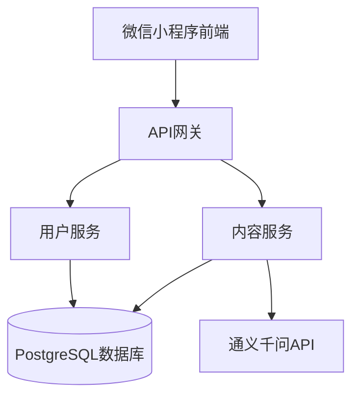
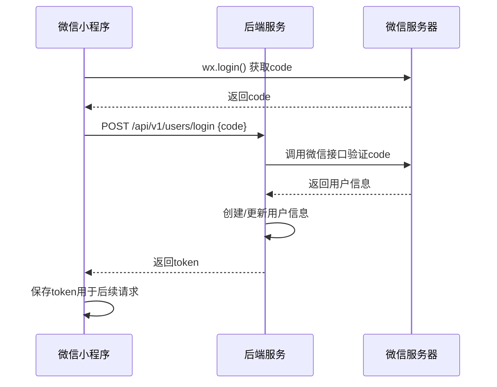
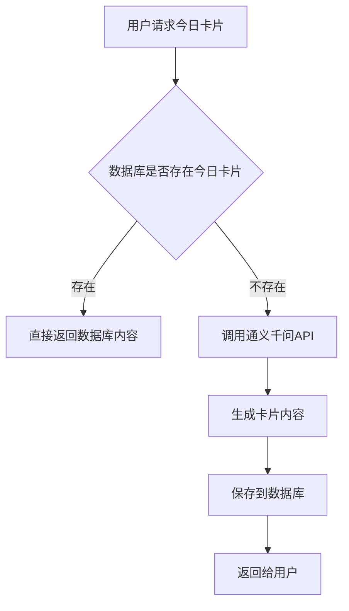
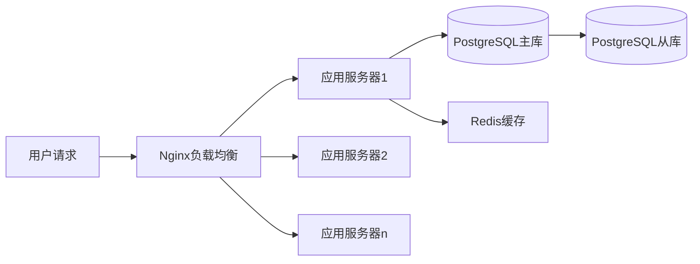

# AI每日灵感卡片小程序开发计划文档

## 1. 概述

### 1.1 项目简介
AI每日灵感卡片是一款微信小程序应用，旨在为用户提供每日的励志语录、诗歌和哲理内容。通过调用通义千问大模型生成高质量的内容，并以卡片形式展示给用户。

### 1.2 核心功能
- 用户注册与登录
- 每日灵感卡片生成（励志/诗歌/哲理）
- 卡片浏览与收藏
- 用户个人中心

### 1.3 技术架构
- 前端：微信小程序
- 后端：Python (Flask/FastAPI)
- 数据库：PostgreSQL
- AI服务：通义千问大模型
- 部署：Docker容器化部署

## 2. 系统架构设计

### 2.1 整体架构图


### 2.2 技术选型
| 层级 | 技术栈 | 说明 |
|------|--------|------|
| 前端 | 微信小程序 | 用户交互界面 |
| 后端 | Python (FastAPI) | API服务提供 |
| 数据库 | PostgreSQL | 数据存储 |
| AI服务 | 通义千问 | 内容生成 |
| 部署 | Docker | 容器化部署 |

## 3. 功能模块设计

### 3.1 用户管理模块
#### 3.1.1 功能描述
- 用户注册/登录
- 用户信息管理
- 用户偏好设置

#### 3.1.2 API接口
| 接口名称 | 请求方法 | 路径 | 描述 |
|---------|---------|------|------|
| 用户注册 | POST | /api/v1/users/register | 用户注册接口 |
| 用户登录 | POST | /api/v1/users/login | 用户登录接口 |
| 获取用户信息 | GET | /api/v1/users/profile | 获取用户信息 |
| 更新用户信息 | PUT | /api/v1/users/profile | 更新用户信息 |

### 3.2 内容生成模块
#### 3.2.1 功能描述
- 调用通义千问生成每日灵感内容
- 内容分类管理（励志/诗歌/哲理）
- 内容存储与检索

#### 3.2.2 API接口
| 接口名称 | 请求方法 | 路径 | 描述 |
|---------|---------|------|------|
| 生成今日卡片 | POST | /api/v1/cards/today | 生成今日灵感卡片 |
| 获取今日卡片 | GET | /api/v1/cards/today | 获取今日灵感卡片 |
| 获取历史卡片 | GET | /api/v1/cards/history | 获取历史卡片列表 |
| 收藏卡片 | POST | /api/v1/cards/favorite | 收藏卡片 |

## 4. 数据库设计

### 4.1 用户表 (users)
| 字段名 | 类型 | 约束 | 描述 |
|-------|------|------|------|
| id | BIGSERIAL | PRIMARY KEY | 用户ID |
| openid | VARCHAR(64) | UNIQUE, NOT NULL | 微信用户唯一标识 |
| nickname | VARCHAR(64) | NOT NULL | 用户昵称 |
| avatar_url | TEXT | - | 用户头像URL |
| created_at | TIMESTAMP | NOT NULL | 创建时间 |
| updated_at | TIMESTAMP | NOT NULL | 更新时间 |

### 4.2 卡片表 (cards)
| 字段名 | 类型 | 约束 | 描述 |
|-------|------|------|------|
| id | BIGSERIAL | PRIMARY KEY | 卡片ID |
| content | TEXT | NOT NULL | 卡片内容 |
| category | VARCHAR(32) | NOT NULL | 卡片分类(励志/诗歌/哲理) |
| author | VARCHAR(64) | - | 作者(如果是引用) |
| date | DATE | NOT NULL | 日期 |
| created_at | TIMESTAMP | NOT NULL | 创建时间 |

### 4.3 用户收藏表 (favorites)
| 字段名 | 类型 | 约束 | 描述 |
|-------|------|------|------|
| id | BIGSERIAL | PRIMARY KEY | 收藏ID |
| user_id | BIGINT | NOT NULL, FOREIGN KEY | 用户ID |
| card_id | BIGINT | NOT NULL, FOREIGN KEY | 卡片ID |
| created_at | TIMESTAMP | NOT NULL | 收藏时间 |

## 5. 后端API设计

### 5.1 认证流程


### 5.2 内容生成流程


## 6. 前端设计

### 6.1 页面结构
1. 首页 - 展示今日灵感卡片
2. 历史页面 - 浏览历史卡片
3. 收藏页面 - 查看收藏的卡片
4. 个人中心 - 用户信息和设置

### 6.2 核心组件
- CardComponent: 卡片展示组件
- CategorySelector: 分类选择组件
- UserProfile: 用户信息组件

## 7. AI集成设计

### 7.1 通义千问API调用
- 接口地址: https://dashscope.aliyuncs.com/api/v1/services/aigc/text-generation/generation
- 请求方法: POST
- 认证方式: API Key
- 请求参数:
  - model: qwen-max
  - input: prompt内容
  - parameters: 生成参数

### 7.2 Prompt设计
```
请生成一条关于{category}的简短内容，长度在50-100字之间，具有启发性和正能量。
类别: {category}
要求:
1. 内容积极向上
2. 语言优美简洁
3. 适合以卡片形式展示
```

## 8. 部署方案

### 8.1 开发环境
- Python 3.9+
- PostgreSQL 13+
- Docker & Docker Compose

### 8.2 生产环境部署


## 9. 测试计划

### 9.1 单元测试
- 用户管理模块测试
- 内容生成模块测试
- 数据库操作测试

### 9.2 集成测试
- API接口测试
- 微信登录流程测试
- AI内容生成测试

### 9.3 端到端测试
- 用户完整使用流程测试
- 异常情况处理测试

## 10. 项目里程碑

### 阶段一：基础框架搭建 (1-2周)
- [ ] 后端API框架搭建
- [ ] 数据库设计与创建
- [ ] 微信登录接口实现
- [ ] 基础用户管理功能

### 阶段二：核心功能开发 (2-3周)
- [ ] 通义千问API集成
- [ ] 卡片生成与存储逻辑
- [ ] 前端页面基础框架
- [ ] 内容展示功能

### 阶段三：完善与优化 (1-2周)
- [ ] 收藏功能实现
- [ ] 历史记录功能
- [ ] 性能优化
- [ ] 完整测试

### 阶段四：部署上线 (1周)
- [ ] 生产环境部署
- [ ] 压力测试
- [ ] 正式上线